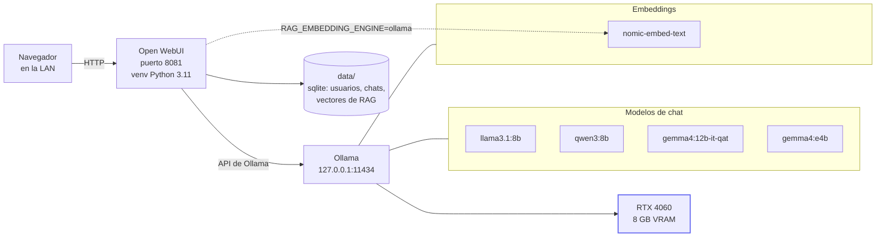

# Arquitectura

## Las piezas

- **Open WebUI** (puerto `8081`): la interfaz. Sirve el frontend, gestiona
  usuarios y sesiones, guarda el historial de chats, y hace de proxy hacia
  Ollama para generar las respuestas. Instalado nativo con `uv` en
  `/opt/chat/venv`, no en contenedor.
- **Ollama** (`127.0.0.1:11434`): ya estaba instalado y corriendo antes de
  este proyecto (`ollama.service`, gestionado aparte — este proyecto no lo
  toca). Carga los modelos en la GPU y genera el texto. Open WebUI habla con
  su API HTTP, nunca directamente con la GPU.
- **GPU** (RTX 4060, 8 GB): el recurso que limita cuántos modelos pueden
  estar cargados a la vez. Ver [docs/modelos.md](modelos.md).
- **`data/`**: la base sqlite de Open WebUI (usuarios, chats, configuración)
  y los vectores del RAG. Vive fuera del repositorio.

## Por qué nativo con `uv` y no Docker

La máquina no tenía Docker instalado, y no formaba parte del encargo montar
un runtime de contenedores para un único servicio. `uv` da un venv aislado
—las dependencias de Open WebUI no chocan con las de otros proyectos de
`/opt`— sin añadir esa capa. El coste que sí tiene esta elección: actualizar
Open WebUI es `uv pip install -U` en vez de tirar de una imagen nueva, y no
hay aislamiento de sistema de archivos o de red como el que daría un
contenedor. Con un único proceso, `User=root` en la unidad systemd y sin
exposición fuera de la LAN, se ha considerado un cambio razonable.

## Dónde encaja `nomic-embed-text` en el RAG

Open WebUI, por defecto, descarga un modelo de `sentence-transformers` desde
Hugging Face la primera vez que se usa RAG. Eso son ~500 MB de descarga de
red y, sobre todo, rompe la premisa de "solo los modelos que ya están en
Ollama": añadiría un modelo de un proveedor externo que nadie pidió.

En su lugar, `RAG_EMBEDDING_ENGINE=ollama` con
`RAG_EMBEDDING_MODEL=nomic-embed-text:latest` (ver `.env.example`) le dice a
Open WebUI que pida los embeddings a Ollama, usando el modelo que ya estaba
descargado para exactamente ese propósito. Cuando alguien sube un documento a
un chat, Open WebUI lo trocea y pide los vectores a `nomic-embed-text` vía
Ollama, no a Hugging Face.

## Decisiones y por qué, en una tabla

| Decisión | Motivo |
|---|---|
| Nativo con `uv`, no Docker | no hay Docker en la máquina; añadirlo es infraestructura fuera de encargo |
| Python 3.11 en el venv | versión con la que Open WebUI se distribuye y prueba oficialmente |
| Solo Ollama (`ENABLE_OPENAI_API=false`) | el encargo es exponer los modelos ya descargados, no añadir proveedores externos |
| Embeddings con `nomic-embed-text` vía Ollama | evita ~500 MB de descarga de Hugging Face y una dependencia de red en el primer arranque |
| Autenticación activada, registro cerrado tras el primer usuario | LAN no es perímetro de confianza; el primer usuario es admin y luego se cierra el alta |
| Puerto `8081` | `8080` está reservado en el portal para el proyecto "Música" |
| `chat-web.service` con `Restart=on-failure` | mismo patrón que el resto de servicios de `/opt` (`debate.service`, `video-pipeline.service`) |

## Fuera de alcance (siguiente paso, no implementado)

- Generación de imágenes vía ComfyUI (que corre en esta misma máquina, puerto
  8188, para otro proyecto).
- Búsqueda web desde el chat.
- Voz: STT y TTS.
- Exponer el servicio fuera de la LAN.
